<architecture_analysis>

### 1. Komponenty i Strony

Na podstawie `auth-spec.md` zidentyfikowano następujące kluczowe elementy, które zostaną uwzględnione w architekturze UI:

**Strony Astro (SSR):**
- `pages/index.astro` (Modyfikacja): Strona powitalna dla gości, przekierowuje zalogowanych użytkowników do panelu.
- `pages/panel.astro` (Modyfikacja): Chroniona strona panelu, wymaga autentykacji.
- `pages/auth/login.astro` (Nowa): Strona z formularzem logowania.
- `pages/auth/register.astro` (Nowa): Strona z formularzem rejestracji.
- `pages/auth/reset-password.astro` (Nowa): Strona do inicjowania resetu hasła.
- `pages/auth/update-password.astro` (Nowa): Strona do ustawiania nowego hasła po resecie.
- `pages/auth/logout.astro` (Nowa): Strona serwerowa do obsługi wylogowania.

**Komponenty React (Client-Side):**
- `components/layout/Header.tsx` (Nowy): Nagłówek aplikacji, dynamicznie wyświetla stan zalogowania.
- `components/auth/LoginForm.tsx` (Nowy): Formularz logowania z walidacją.
- `components/auth/RegisterForm.tsx` (Nowy): Formularz rejestracji z walidacją.
- `components/auth/ResetPasswordForm.tsx` (Nowy): Formularz do wysyłania linku resetującego hasło.
- `components/auth/UpdatePasswordForm.tsx` (Nowy): Formularz do zmiany hasła.
- `components/panel/PanelPage.tsx` (Istniejący): Główny komponent panelu, będzie otrzymywać `userId` z `panel.astro`.

**Layouty Astro:**
- `layouts/Layout.astro` (Modyfikacja): Główny layout aplikacji, będzie zawierał nowy `Header`.

### 2. Przepływ Danych

1.  Użytkownik wchodzi na stronę (np. `/`), strona Astro (`index.astro`) po stronie serwera sprawdza sesję w `Astro.locals`.
2.  Jeśli użytkownik jest niezalogowany, renderowany jest komponent `WelcomePage` wewnątrz `Layout.astro`, który zawiera `Header` ze stanem `isAuthenticated: false`.
3.  Użytkownik przechodzi do `/auth/login`. Strona `login.astro` renderuje komponent React `LoginForm`.
4.  `LoginForm` po stronie klienta komunikuje się z API (`/api/auth/login`) w celu weryfikacji poświadczeń.
5.  Po pomyślnym zalogowaniu, API ustawia cookie sesji, a strona jest przeładowywana (`window.location.href`), co prowadzi do przekierowania na `/panel`.
6.  Strona `panel.astro` (SSR) weryfikuje sesję. Jeśli jest poprawna, pobiera `userId` i przekazuje go jako prop do komponentu `PanelPage.tsx`.
7.  `Layout.astro` renderuje `Header` ze stanem `isAuthenticated: true`, wyświetlając e-mail użytkownika i przycisk wylogowania.

### 3. Funkcjonalność Komponentów

- **Strony Astro (`.astro`):** Odpowiedzialne za routing, logikę serwerową (auth guards, pobieranie danych) i osadzanie komponentów React.
- **Komponenty Formularzy (`.tsx`):** Zarządzają stanem formularza, walidacją po stronie klienta i komunikacją z endpointami API autentykacji.
- **Layout i Header:** Tworzą spójną strukturę wizualną i nawigację, dostosowując się do stanu autentykacji użytkownika.
- **PanelPage:** Główna funkcjonalność aplikacji dla zalogowanego użytkownika, operuje na `userId`.

```mermaid
flowchart TD
    classDef new fill:#c8e6c9,stroke:#388e3c,stroke-width:2px;
    classDef modified fill:#fff9c4,stroke:#fbc02d,stroke-width:2px;
    classDef existing fill:#eeeeee,stroke:#616161,stroke-width:2px;

    subgraph " przeglądarka użytkownika"
        direction LR
        subgraph "Strony Astro (SSR)"
            direction TB
            
            WelcomePage["/index.astro"]:::modified
            PanelAstro["/panel.astro"]:::modified
            
            subgraph "Nowe Strony Autentykacji"
                direction TB
                LoginPage["/auth/login.astro"]:::new
                RegisterPage["/auth/register.astro"]:::new
                ResetPasswordPage["/auth/reset-password.astro"]:::new
                UpdatePasswordPage["/auth/update-password.astro"]:::new
                LogoutPage["/auth/logout.astro"]:::new
            end
        end

        subgraph "Komponenty UI (React)"
            direction TB

            subgraph "Layout"
                LayoutAstro["layouts/Layout.astro"]:::modified
                Header["components/layout/Header.tsx"]:::new
            end

            subgraph "Nowe Komponenty Formularzy"
                LoginForm["components/auth/LoginForm.tsx"]:::new
                RegisterForm["components/auth/RegisterForm.tsx"]:::new
                ResetPasswordForm["components/auth/ResetPasswordForm.tsx"]:::new
                UpdatePasswordForm["components/auth/UpdatePasswordForm.tsx"]:::new
            end
            
            PanelPage["components/panel/PanelPage.tsx"]:::existing
        end
    end

    subgraph "Backend (Astro/Node.js)"
        direction TB
        subgraph "API Endpoints"
            ApiRegister["POST /api/auth/register"]:::new
            ApiLogin["POST /api/auth/login"]:::new
            ApiReset["POST /api/auth/reset-password"]:::new
            ApiUpdate["POST /api/auth/update-password"]:::new
            ApiAccount["DELETE /api/auth/account"]:::new
        end

        subgraph "Middleware & Libs"
            Middleware["middleware/index.ts"]:::modified
            AuthGuards["lib/auth-guards.ts"]:::new
            Validation["lib/validation/auth.validation.ts"]:::new
        end
    end

    subgraph "Zewnętrzne Usługi"
        SupabaseAuth["Supabase Auth"]
        SupabaseDB["Supabase DB (RLS)"]
    end

    %% Relacje Strony -> Komponenty
    WelcomePage -- "Renderuje stronę powitalną" --> LayoutAstro
    PanelAstro -- "Renderuje panel użytkownika" --> PanelPage
    LoginPage -- "Renderuje formularz" --> LoginForm
    RegisterPage -- "Renderuje formularz" --> RegisterForm
    ResetPasswordPage -- "Renderuje formularz" --> ResetPasswordForm
    UpdatePasswordPage -- "Renderuje formularz" --> UpdatePasswordForm

    LayoutAstro -- "Osadza nagłówek" --> Header
    PanelAstro -- "Przekazuje userId" --> PanelPage

    %% Relacje Komponenty -> API
    LoginForm -- "Wysyła dane logowania" --> ApiLogin
    RegisterForm -- "Wysyła dane rejestracji" --> ApiRegister
    ResetPasswordForm -- "Wysyła email" --> ApiReset
    UpdatePasswordForm -- "Wysyła nowe hasło" --> ApiUpdate

    %% Relacje Strony -> Middleware (niejawne)
    WelcomePage -.-> Middleware
    PanelAstro -.-> Middleware
    LoginPage -.-> Middleware

    %% Relacje Backend -> Supabase
    ApiLogin --> SupabaseAuth
    ApiRegister --> SupabaseAuth
    ApiReset --> SupabaseAuth
    ApiUpdate --> SupabaseAuth
    ApiAccount --> SupabaseAuth
    SupabaseAuth -- "Tworzy użytkownika" --> SupabaseDB

    Middleware -- "Pobiera sesję" --> SupabaseAuth

    %% Relacje Auth Guards
    PanelAstro -- "Używa Auth Guard" --> AuthGuards
    AuthGuards -- "Sprawdza sesję" --> Middleware
```

</architecture_analysis>

<mermaid_diagram>

</mermaid_diagram>
